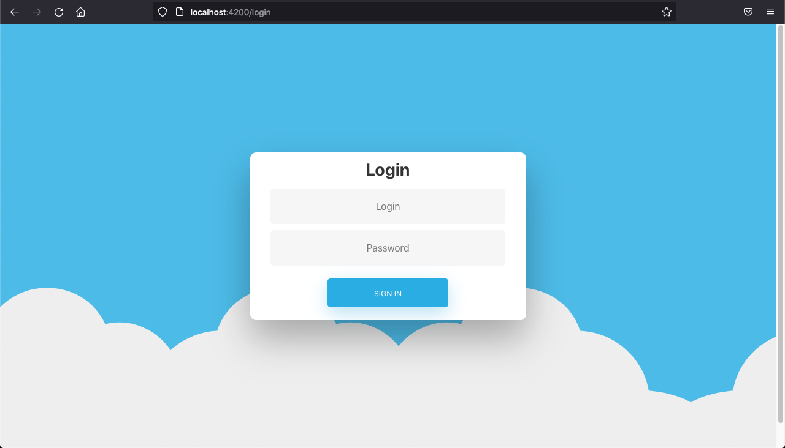
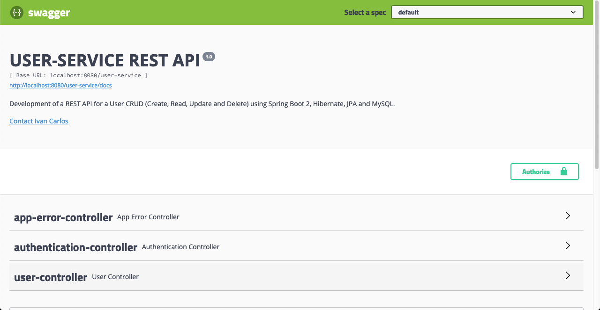
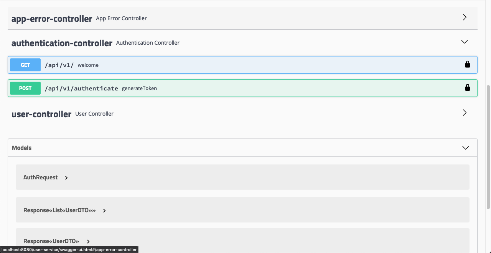
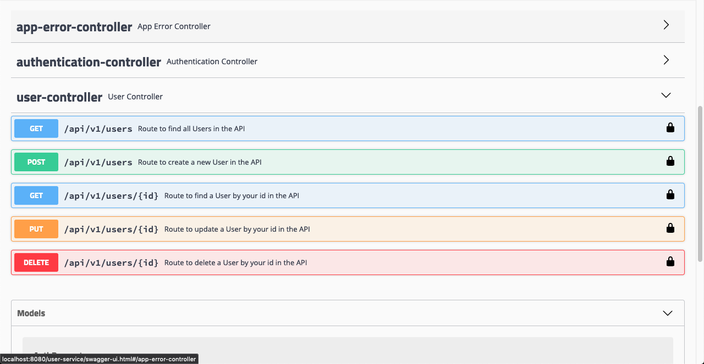
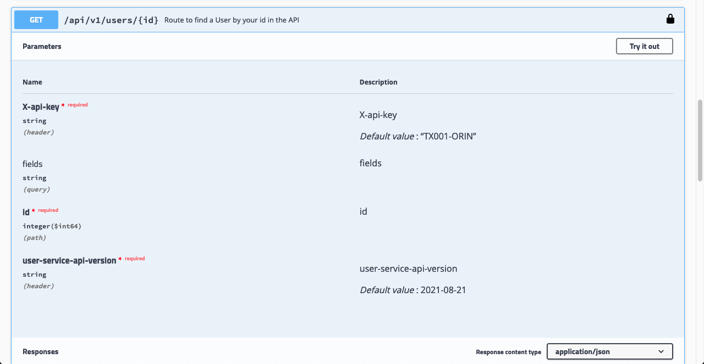
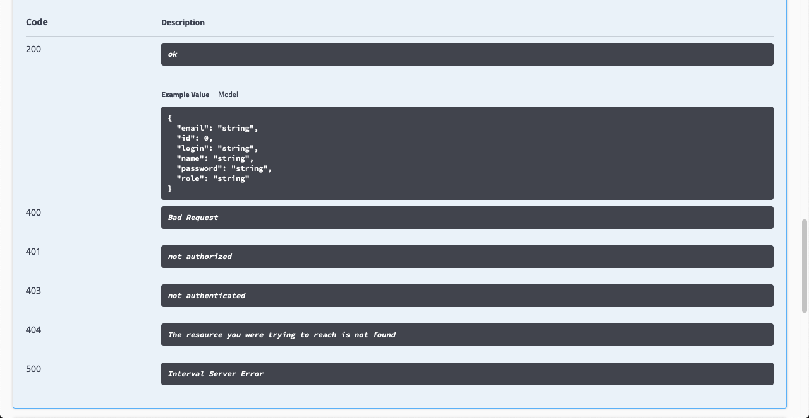
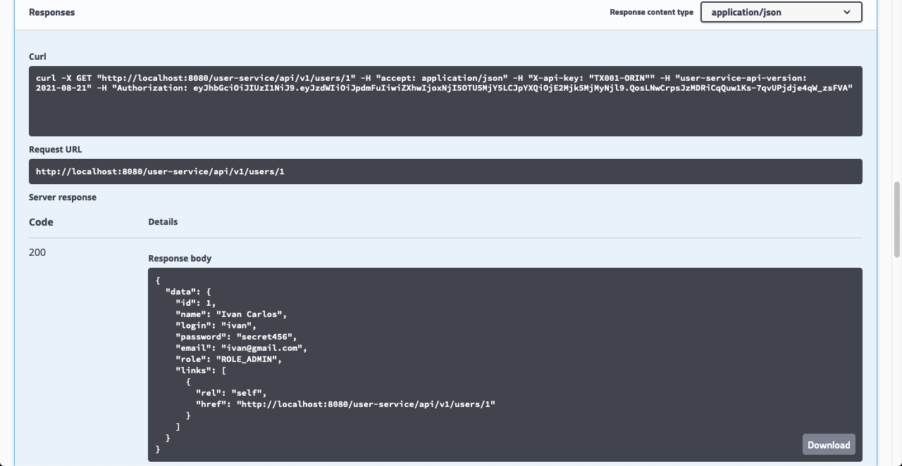
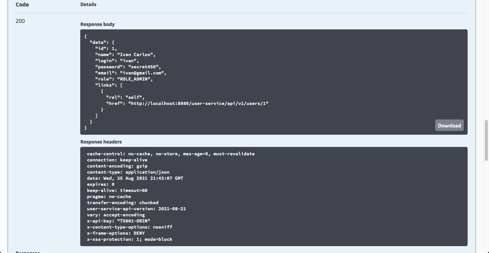
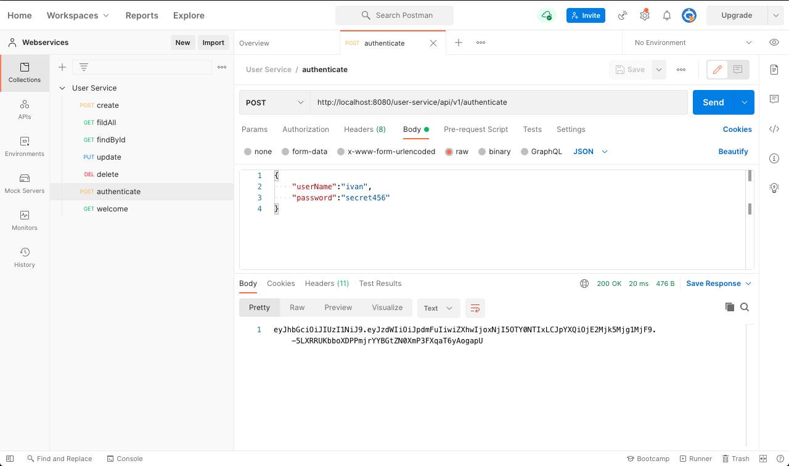

# ms-users-modules [Solução Java / SpringBoot / Angular]

# Module-API

This project was generated with Spring Boot.

# Module-WEB

This project was generated with [Angular CLI](https://github.com/angular/angular-cli) version 12.2.2.

# Images

  
  
  

  
  
  

  
  
  

