# ms-users-modules

[Solution Java / SpringBoot / Angular 12 / Docker / Microservices / Kafka / RabbitMQ / Redis / MySql]

## Prerequisites

To be able to follow through in this challenge you should have:

- An integrated development environment  (IDE) like VS Code
- Node version 11.0 installed on your machine
- Node Package Manager version 6.7  (it usually ships with Node installation)
- [Angular CLI](https://cli.angular.io/) version 8.0 or above
- The latest version of Angular  (version 12):

# Module-API

This project was generated with Spring Boot.

# Module-WEB

This project was generated with [Angular CLI](https://github.com/angular/angular-cli) version 12.2.2.

# Images

  
  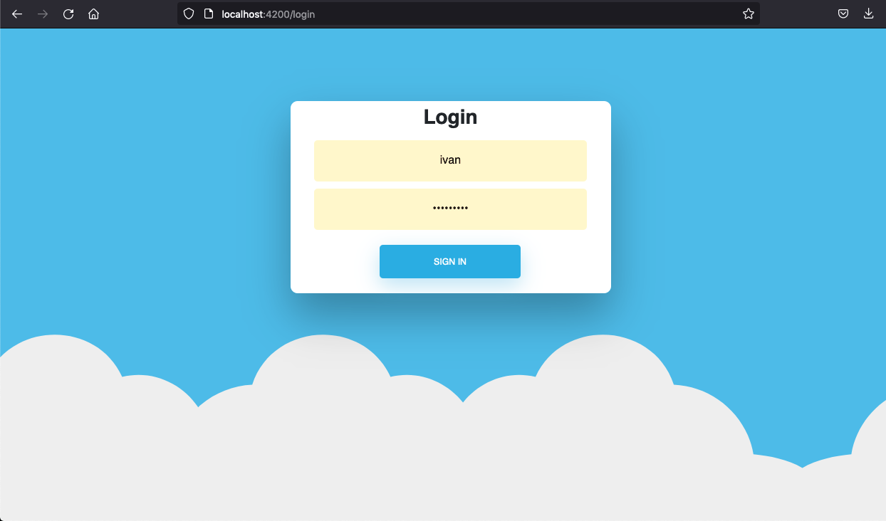
  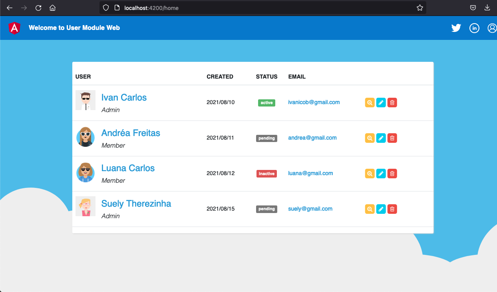

  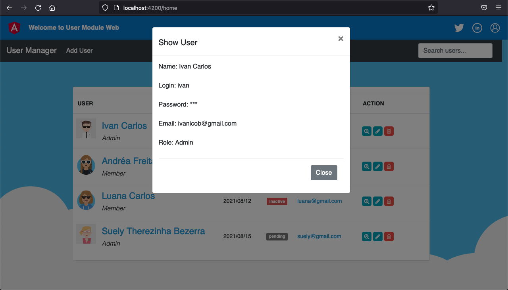
  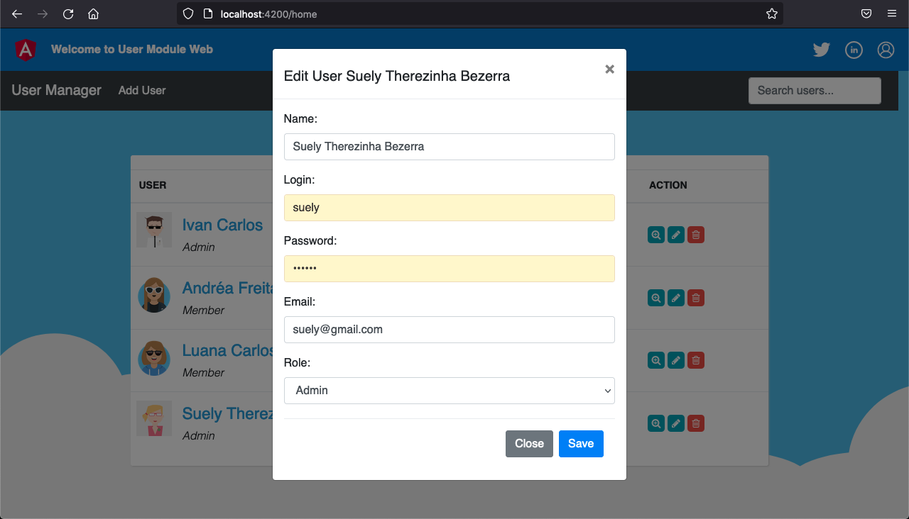
  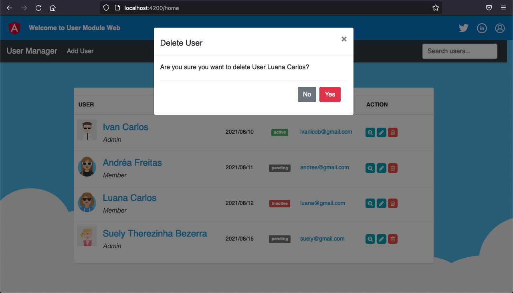

  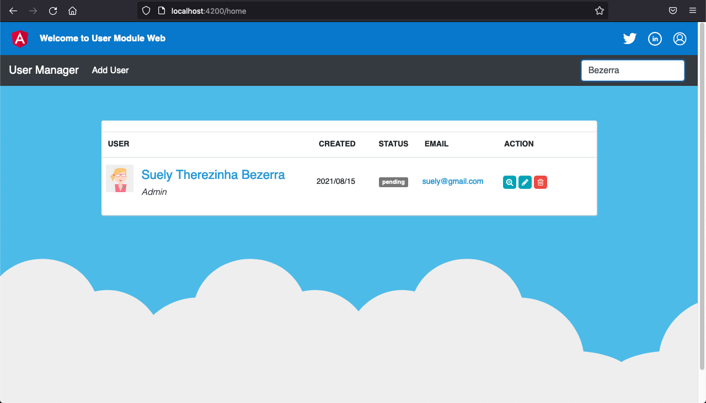
  
  

  
  
  

  
  
  

  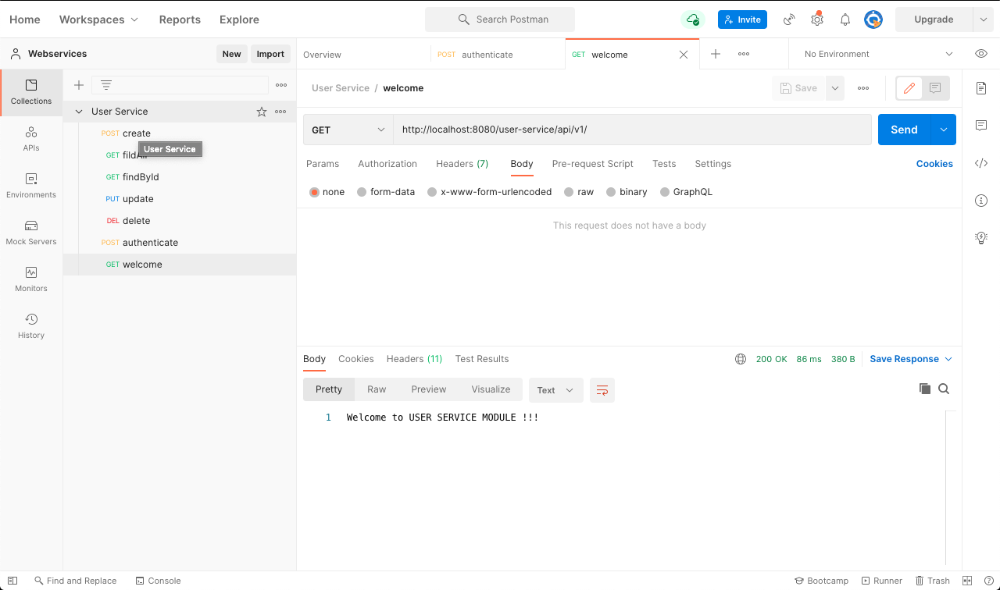
  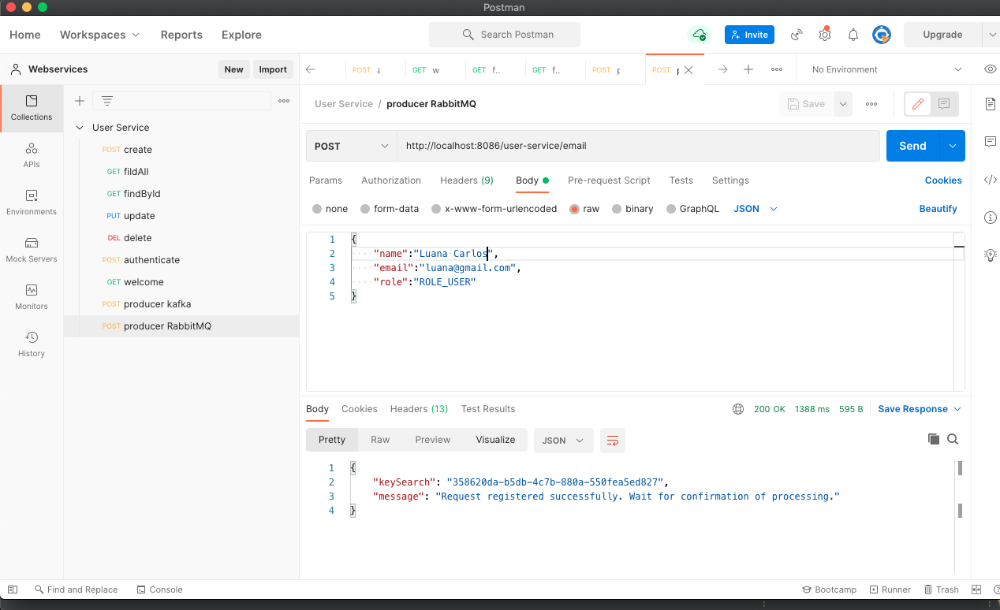
  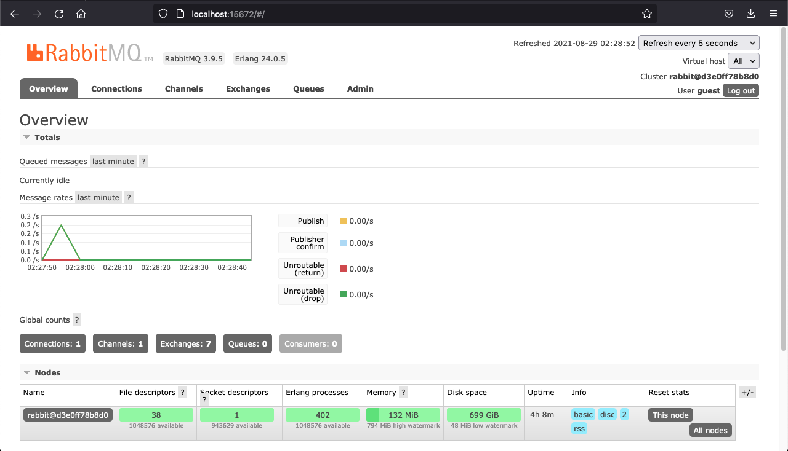

  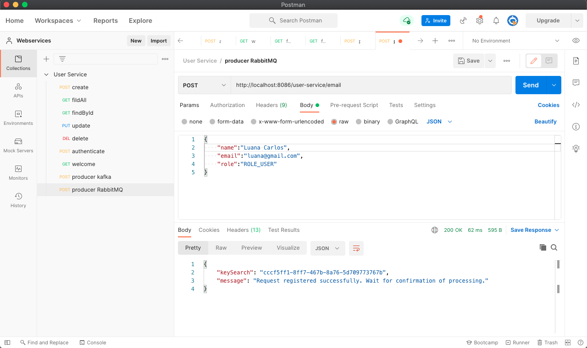
  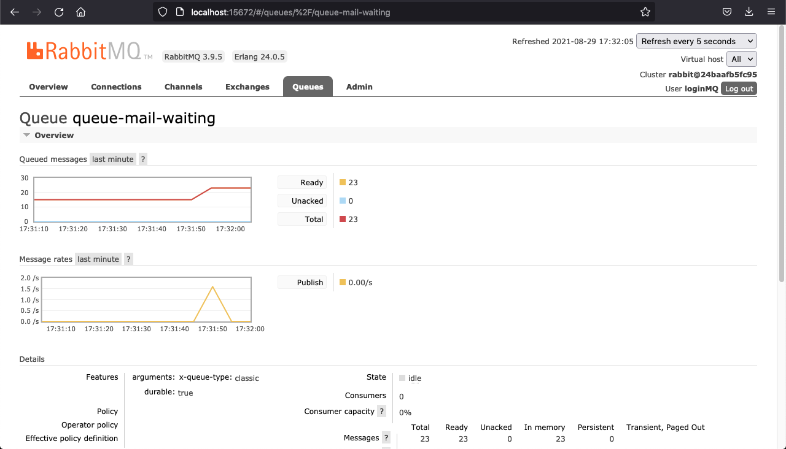
  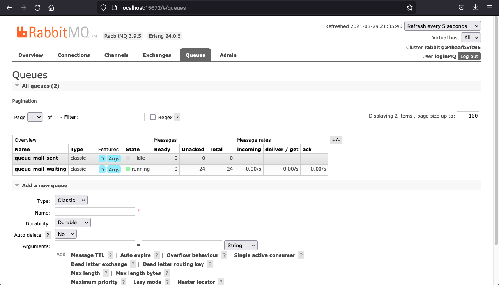

  
  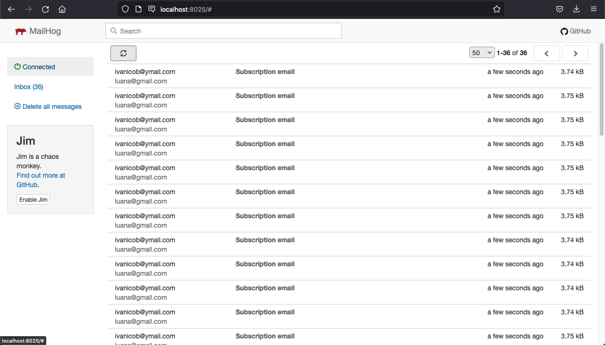
  

  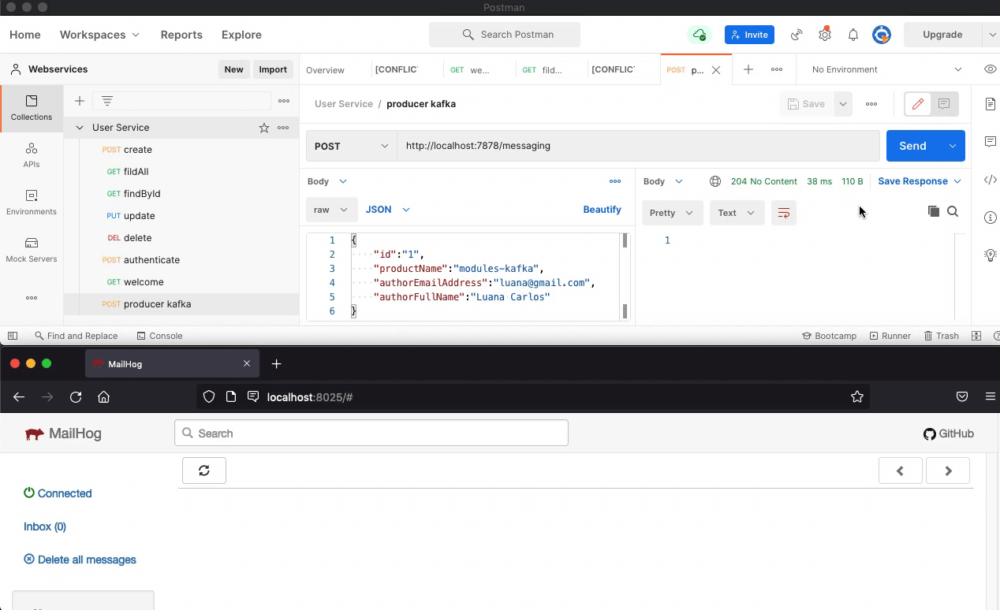
  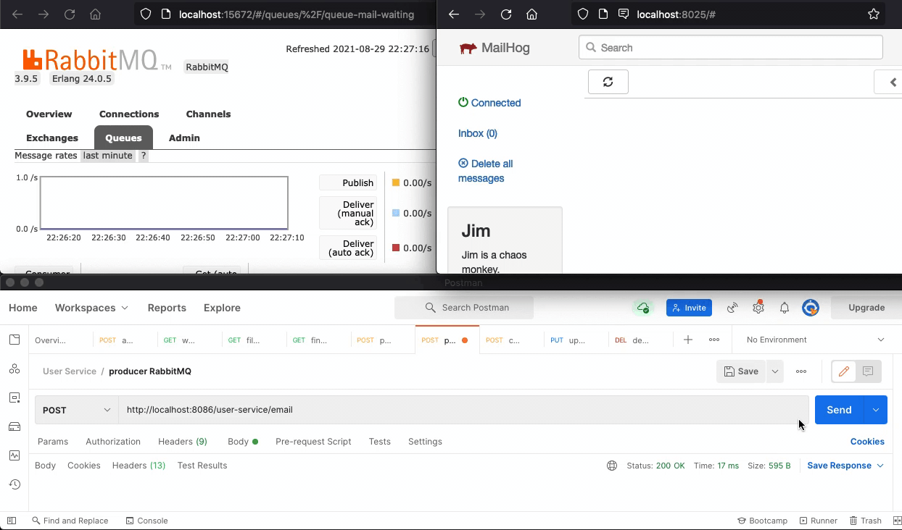

